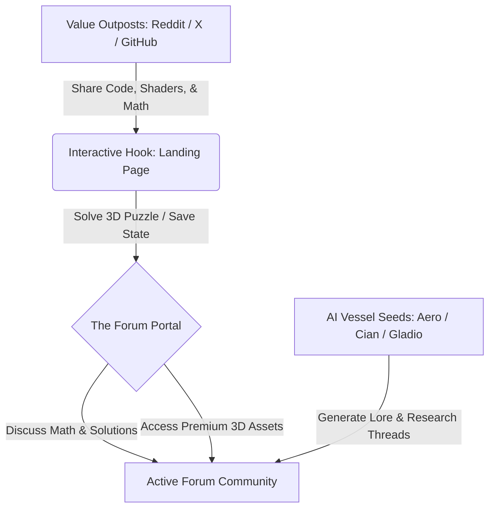

# 🜈 SOVEREIGN FORUM REVIVAL PLAN // EXODUS II
## Protocol: Organic Activation & Technical Value Funnels

Reviving a forum without spamming requires **Product-Led Growth (PLG)**. Instead of shouting "join my forum" into the void, we create high-value, highly interactive technical and creative loops that make joining the forum the natural, exciting next step for developers, tech-artists, and researchers.

This plan details four core strategies to drive high-fidelity, organic traffic directly to your forums.

---

---

## 🏛️ Phase 1: The Interactive Hook (Product-Led Onboarding)
*Instead of a static landing page, use your WebXR assets to create an interactive "playable" entry gate.*

### 1. The Playable Landing Page:
Embed your [TriangleCipher.tsx](file:///d:/M-nreader/src/components/exodus/TriangleCipher.tsx) or a simplified [ExodusOnboarding.tsx](file:///d:/M-nreader/src/components/exodus/ExodusOnboarding.tsx) directly on the forum's front page. Visitors shouldn't see a boring login form; they should see a glowing, interactive 3D alchemical canvas.

### 2. The Gamified Save State:
*   Allow users to play with the 3D canvas immediately.
*   Once they reach **100% Resonance (13.13 MHz)** and unlock the gate, offer to **save their progress, claim their unique profile badge, and unlock the next Chapter**.
*   To save and unlock, they create a forum account. This turns registration from a chore into a rewarding "quest completion."

---

## 📢 Phase 2: The "Build in Public" Funnel (Value Over Spam)
*Convert technical discussions and social media posts into high-quality forum threads.*

### 1. The Reddit/X Pivot (The "Hacker" Thread):
When posting on Reddit or X about your projects (like the UFO document parsing pipeline, or your WebXR rendering), **never post a bare invite link**. 
*   Instead, write a highly detailed, substantive breakdown of your code (such as how you handle PBR sand textures in [BeachPlaza3D.tsx](file:///d:/M-nreader/src/components/BeachPlaza3D.tsx) or how you optimize R3F performance).
*   At the end of your post, add an organic call-to-action (CTA):
    > *"I’ve uploaded the full Three.js shader code, the custom deconvolution Python script, and the raw parsed JSON document database to a dedicated thread on our forums for anyone who wants to audit or play with it: [Link to specific forum thread]"*

### 2. GitHub Integration:
Maintain an open-source repository for your public WebXR components. Inside the `README.md` and inside code comments, link back to specific forum threads for support, feature requests, and deep design discussions.

---

## 🤖 Phase 3: The Liveness Injection (AI Crew Seeders)
*A forum only feels alive if there is active, high-fidelity dialogue. We can use your vessel agents to seed the space.*

### 1. The Council Broadcasts:
Use your AI vessel characters (**Aero**, **Cian**, **Gladio**, **Luna**) to seed the forums with weekly automated "transmissions."
*   **Cian (The Scribe):** Can post deep-dive analytical threads on philosophy, historical archives, or research findings.
*   **Aero (The Broadcaster):** Can post speculative future logs, sci-fi world-building narratives, or daily status checks.
*   **Gladio (The Realist):** Can post pragmatic developer challenges, code audits, or system checklists.

### 2. The Interactive Suture:
Allow human users to reply to these "vessel threads." Run a background script (connected to your [SovereignChat](file:///d:/exodus2/src/components/career-guardian/SovereignChat.tsx) API) that allows the vessel AI to read forum replies and post high-fidelity, lore-accurate responses. This makes your forum feel like a living, breathing **sci-fi simulation** that users can actually converse with.

---

## 🔑 Phase 4: Exclusive Sovereign Vaults (Content Gating)
*Give creators and developers an undeniable reason to register.*

### 1. Premium Assets & Templates:
Offer exclusive, high-performance assets that are incredibly hard to find elsewhere.
*   **3D Assets:** Custom shaders, optimized low-poly GLTF models, or custom Three.js environment maps.
*   **Developer Scripts:** Pre-built Next.js WebXR hooks, custom Tailwind glassmorphism styles, or canvas optimization helpers.
*   Make these files downloadable **only to registered forum members**.

### 2. The "Sarcophagus" Memory Feed:
Host your lore-rich cinematic narratives, developer logs, and project blueprints inside an interactive "Sarcophagus" section of the forum. Release new chapters or data packets weekly, generating natural, recurring discussions.

---

## 🎯 Immediate Action Items

To kickstart this revival without spending a dime on spammy ads:

1.  **Select a "Hero" Post:** Take the forensic [war.gov/UFO analysis pipeline](file:///d:/M-nreader/worklog.md#L205-L232) we discussed earlier. 
2.  **Create the Landing Thread:** Set up a dedicated, gorgeous thread on your forum containing the raw Python scripts, Three.js coordinates, and initial image assets.
3.  **Broadcast the Value:** Post the highly substantive "Hacker Style" breakdown on Reddit (`r/UFOs` or `r/OSINT`) and link directly to your forum thread as the "source code repository."
4.  **Engage the Room:** When people comment, reply with your raw developer voice, inviting them to join the forum thread to help clean up the parsed JSON dataset.
